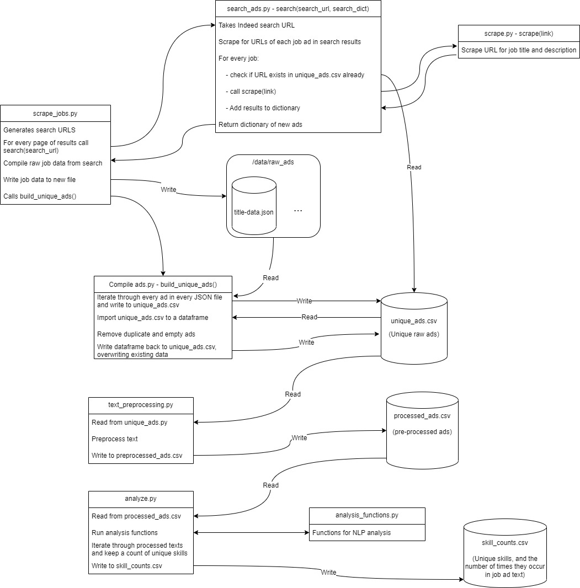

# Will McFarland

# Project Description

Project for COSC 329 - Learning Analytics to scrape and analyze over 10'000 job ads

Scrape a job website (such as indeed.ca) for job postings with two or more specific job titles and one location. Then parse the text in the postings to analyze required skills. You'll need to think about how skills are defined and use existing NLP libraries to preprocess the texts. Make sure you do something beyond simple keyword or bag of words to recognize skills. Then, do some data analyses to visualize the most sought after skills for these jobs and how the skills are different between the two job titles you searched for.

Scrape 10,000+ job postings, identify 3+ NLP library functions you will use to preprocess the text, explain what each function does and why you chose them, extract skills from the text based on the output of your NLP preprocessing, explain how your extraction algorithm works (i.e., define what you consider to be skills in the text), show the top skills for each job title, compute the overlap between the skills of the two jobs (e.g., using the Bhattacharyya coefficient).

# Schedule

Week 8: planning

Week 9: setup

- Set up repository, development environment, and dependencies

- Decide on at least 3 NLP functions

- Initial setup for web scraper

Week 10 (midterm break): gather data

- Decide on job titles and location

- Finalize web scraper

- Gather data (10'000+ postings)

Week 11: Analysis

- Preprocess texts with NLP functions

- Conduct analysis to extract skills

Week 12: Finish analysis, and start video and deliverables

- Create visualizations

- Start writing conclusion, and answering questions in project description

Week 13: presentation video

Week 14: project deliverables.

# Program Flow and File Structure

The flowchart below describes the interaction between all files in detail.

Files not included in the above flowchart:
 - **`report.ipynb`: The project report notebook!**
 - `demo_report.ipynb`: Exerpt from the full report ran on a smaller dataset for the demo video.
 - `slides.pptx`: Slides used in the demo video.
 - `testing.py`: Unit tests for the major components of the project.

# Instructions - How to run the code

 1. **Scrape ads**: Open `scrape-jobs.py` and modify lines 9 and 10 to be the desired search terms. Run with `python scrape_jobs.py`. Once the script is complete, it will print out a preview of the results. The full results can be seen in `data/unique_ads.csv`.
 
 2. **Pre-process ads**: The scraped ad text is very raw and contains characters we want remove before our analysis. We can now run `python text_preprocessing.py` to process the text. This script will output to `data/processed_ads.csv`.

 3. **Analyze ads**: Its now time to run the NLP functions on our data. This is somewhat time-consuming to run on the full dataset, but when you're ready you can run `python analyze.py` to analyze all job ads. This will output to `data/skill_counts.csv` and `data/job_skills.csv`.

 4. The last step is to look at the results!

 - To run the unit tests, simply run `python testing.py`. Note that as job ads on Indeed change, these tests may fail. See the comments in the code for more details.

# Demo Video

[See the demo video here](https://youtu.be/g_iUF5H22Kc)

 # Challenges/Shortcomings

The biggest challenge with this project was the scraping stage. First there was challenges with ratelimiting, where Indeed will return a Captcha if more than approximately 800 requests are sent in short succession. I was able to get around this by waiting between requests, and using a VPN to change my IP address to avoid wait times. Beyond that, Indeed limits search results to 1000 per search. That is, even a search claims there are 5'000 results, I will realistically only be able to fetch the first 1'000. There were a couple workarounds here, namely sorting by date vs relavence, and setting different search distances to shuffle the results a little bit. In the end, I needed to broaden my search terms to reach 10'000 ads, even if it meant that I wouldn't be getting that much more useful data. I did always ensure that the results were unique however. The metric I used for uniqueness was the URL, which I later realized was an imperfect metric, as some ads had duplicate (or near-duplicate) job descriptions, but in different postings/URLs.

Another challenge I faced was defining skills. As mentioned in the case study in class, there is very little research into this topic, so I just went with the example given in that case study. As expected, it proved to be a weak method for identifying skills as it produced a lot of false positives (phrases that were not actually skills). Fortunetely, it worked well enough to produce some useful results, and after cleaning some of the data I found that it did identify many real skills from the ads that make sense for the given job titles.

I also realized in the analysis stage that 'Software Developer' may have been too specific of a term. Many of the results did not actually contain 'software developer' in the job title, which forced me to exclude a lot of my data from the analysis in order to maintain consistency.

**What I would do if I had more time...**

 - Look for more ads by broadening my geographic search area
 - Filter out duplicate or near-duplicate ad descriptions
 - Improve my chunking patterns to better catch skills
 - Choose a broader search term than 'software developer'